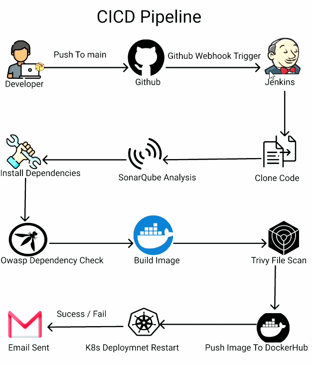

<div align="center">

# ✨ GlamAI — Model Service

**AI-Powered Face Analysis & Personalized Makeup Recommendation Engine**

[](https://python.org)
[](https://flask.palletsprojects.com)
[](https://docker.com)
[](https://kubernetes.io)
[](https://jenkins.io)
[](https://mediapipe.dev)
[](https://ollama.ai)

---

*An intelligent system that analyzes facial geometry from a single photo and delivers personalized, step-by-step makeup recommendations using computer vision, anthropometric science, and generative AI.*

</div>

---

## 📑 Table of Contents

- [Overview](#-overview)
- [System Architecture](#-system-architecture)
- [Tech Stack](#-tech-stack)
- [Pipeline Flow](#-pipeline-flow)
- [API Reference](#-api-reference)
- [Docker](#-docker)
- [Kubernetes Deployment](#-kubernetes-deployment)
- [CI/CD Pipeline](#-cicd-pipeline)
- [Getting Started](#-getting-started)
- [Project Structure](#-project-structure)

---

## 🧠 Overview

**GlamAI Model Service** is the core AI backend that transforms a user's selfie into personalized makeup guidance. Rather than relying on generic beauty advice, GlamAI measures the unique geometry of each face — eye shape, nose proportions, lip fullness, jawline structure, and more — then retrieves the most relevant professional makeup techniques from a curated knowledge base, enhanced with AI-generated explanations.

### ✨ Key Capabilities

| Capability | Description |
|---|---|
| 🎯 **478-Point Landmark Detection** | Google MediaPipe face mesh for precise facial geometry mapping |
| 📐 **Anthropometric Measurement** | Normalized metrics across 8 distinct facial regions |
| 🏷️ **Rule-Based Classification** | Feature classification grounded in facial morphology science |
| 🤖 **RAG + LLM Generation** | ChromaDB vector search + Ollama/Phi3 for personalized recommendations |
| 🌐 **Production-Ready API** | Flask + Gunicorn REST API with health checks and CORS support |

---

## 🏗 System Architecture

<div align="center">


</div>

### Layered Processing Model

| Stage | Input | Output | Module |
|-------|-------|--------|--------|
| **Layer 1** — Extraction | Raw image (PNG/JPG) | 478 landmark coordinates `(x, y, z)` | `layer1_extraction.py` |
| **Layer 2** — Metrics | Landmarks + image dims | ~20 normalized ratios & angles | `layer2_metrics.py` |
| **Layer 3** — Classification | Normalized metrics | Classified features JSON | `layer3_classify.py` |
| **Generation** — RAG + LLM | Classifications + Knowledge | Personalized makeup recommendations | `generation.py` · `retrieve.py` |

---

## 🛠 Tech Stack

<table>
<tr><th>Category</th><th>Technology</th><th>Purpose</th></tr>
<tr><td><b>Language</b></td><td></td><td>Core application language</td></tr>
<tr><td><b>Web Framework</b></td><td></td><td>REST API server</td></tr>
<tr><td><b>WSGI Server</b></td><td></td><td>Production HTTP server (2 workers, 2 threads)</td></tr>
<tr><td><b>Computer Vision</b></td><td></td><td>478-point face landmark detection</td></tr>
<tr><td><b>Image Processing</b></td><td></td><td>Image loading, resizing, color conversion</td></tr>
<tr><td><b>Vector Database</b></td><td></td><td>In-memory semantic search for knowledge retrieval</td></tr>
<tr><td><b>Embeddings</b></td><td></td><td><code>all-MiniLM-L6-v2</code> for query/document embeddings</td></tr>
<tr><td><b>LLM</b></td><td></td><td>Local LLM for generating personalized explanations</td></tr>
<tr><td><b>Containerization</b></td><td></td><td>Multi-stage build & service orchestration</td></tr>
<tr><td><b>Orchestration</b></td><td></td><td>Production deployment, scaling & ingress</td></tr>
<tr><td><b>CI/CD</b></td><td></td><td>Automated build, scan, push & deploy pipeline</td></tr>
<tr><td><b>Code Quality</b></td><td></td><td>Static analysis & quality gate</td></tr>
<tr><td><b>Security</b></td><td></td><td>File system & container image vulnerability scanning</td></tr>
</table>

---

## 🔄 Pipeline Flow

```
 📸 User Photo
      │
      ▼
 ┌─────────────┐
 │  MediaPipe   │──▶ 478 landmarks (x, y, z)
 └─────────────┘
      │
      ▼
 ┌─────────────┐
 │  Metrics     │──▶ ~20 normalized ratios & angles
 └─────────────┘
      │
      ▼
 ┌─────────────┐
 │  Classifier  │──▶ 8 feature categories with labels
 └─────────────┘      (face shape, eyes, nose, lips,
      │                eyebrows, jaw, chin, cheekbones)
      ▼
 ┌─────────────┐    ┌──────────────┐
 │  ChromaDB   │◀───│ 29 Knowledge │
 │  Retrieval  │    │ Entries      │
 └──────┬──────┘    └──────────────┘
        │
        ▼
 ┌─────────────┐
 │  Phi3 LLM   │──▶ Per-feature recommendations
 └─────────────┘     • Technique + Steps
      │               • Why it matches
      ▼               • Awareness tips
 📋 JSON Response
```

---

## 🌐 API Reference

### Health Check

```http
GET /
```

**Response** `200 OK`

```json
{ "status": "ok", "message": "GlamAi API is running" }
```

### Analyze Face

```http
POST /analyze
Content-Type: multipart/form-data
```

| Parameter | Type | Description |
|-----------|------|-------------|
| `image` | `file` | Face photo — PNG, JPG, JPEG, WEBP, or BMP (max 10 MB) |

**Response** `200 OK`

```json
{
  "success": true,
  "face_features": {
    "face_shape": { "primary": "oval", "secondary": "round", "ratio": 0.93 },
    "eyes": { "shape": "almond", "orientation": "balanced", "spacing": "balanced" },
    "nose": { "width": "average", "length": "average", "tip": "defined" },
    "lips": { "fullness": "medium", "balance": "balanced", "contour": "natural" },
    "eyebrows": { "arch": "soft arch", "thickness": "natural" },
    "jaw_chin": { "jaw": "balanced", "chin_shape": "balanced" },
    "cheekbones": { "prominence": "moderate", "height": "high-set" }
  },
  "human_readable": "Your face shape is oval with subtle round influence...",
  "recommendations": [
    {
      "feature": "eyes",
      "variant": "almond",
      "technique": "crease definition",
      "steps": ["Apply light base over lid.", "Define crease softly."],
      "why_it_matches": "...",
      "awareness": "..."
    }
  ]
}
```

| Error Code | Scenario |
|------------|----------|
| `400` | No image provided / empty filename / unsupported format |
| `422` | No face detected in image |
| `500` | Internal processing error |

---

## 🐳 Docker

### Multi-Stage Build

```
 ┌─────────────────────────────┐      ┌─────────────────────────────┐
 │   Stage 1: Builder           │      │   Stage 2: Runtime           │
 │                               │      │                               │
 │  python:3.11-slim             │      │  python:3.11-slim             │
 │  • Install build tools        │      │  • Runtime libs only          │
 │  • pip install dependencies  ─┼─────▶│  • COPY /install from builder │
 │  • Download & verify          │      │  • Application code           │
 │    face_landmarker.task       │      │  • Verified ML model          │
 │    (~29MB, Float16)           │      │  • Gunicorn + tini (PID-1)    │
 └─────────────────────────────┘      └─────────────────────────────┘
```

### Docker Compose Stack

```yaml
# 3 services orchestrated together
services:
  ollama        →  LLM server (port 11434, persistent volume)
  ollama-pull   →  Init container — pulls phi3 model on startup
  face-api      →  GlamAI Flask API (port 5000, 2 GB memory limit)
```

### Quick Start with Docker Compose

```bash
# Build and start all services
docker compose up --build -d

# Check service health
curl http://localhost:5000/

# Analyze a face
curl -X POST -F "image=@photo.jpg" http://localhost:5000/analyze
```

---

## ☸️ Kubernetes Deployment

GlamAI is production-deployed on a Kubernetes cluster with full orchestration, auto-scaling, and ingress routing.

### K8s Resource Manifests

```
k8s/
├── 00_cluster.yml             # KIND cluster — 1 control plane + 3 workers
├── namespace.yml              # glamai-ns namespace
├── configMaps.yml             # Environment configuration (ports, URLs, secrets)
├── 05_model_deployment.yml    # Deployment — 2 replicas, resource limits
├── 05_model_service.yml       # ClusterIP service — port 5000
├── hpa-model.yml              # HorizontalPodAutoscaler (2–5 pods, 20% CPU)
└── ingress.yml                # NGINX ingress — path-based routing with CORS
```

### Auto-Scaling (HPA)

| Parameter | Value |
|-----------|-------|
| **Min Replicas** | 2 |
| **Max Replicas** | 5 |
| **Scale-Up Trigger** | CPU utilization > 20% |
| **Scale-Down Window** | 30s stabilization |
| **Resource Requests** | 200m CPU / 256Mi Memory |
| **Resource Limits** | 500m CPU / 512Mi Memory |

### Deploy to Kubernetes

```bash
# Create the cluster
kind create cluster --config k8s/00_cluster.yml

# Apply manifests
kubectl apply -f k8s/namespace.yml
kubectl apply -f k8s/configMaps.yml
kubectl apply -f k8s/05_model_deployment.yml
kubectl apply -f k8s/05_model_service.yml
kubectl apply -f k8s/hpa-model.yml
kubectl apply -f k8s/ingress.yml

# Verify deployment
kubectl get pods -n glamai-ns
kubectl get hpa -n glamai-ns
```

---

## 🚀 CI/CD Pipeline

GlamAI uses a fully automated **Jenkins** pipeline with security scanning at every stage.

<div align="center">



</div>

### Stage Details

| # | Stage | Tool | Description |
|---|-------|------|-------------|
| 1 | **Clone Code** | Git | Pull latest from `main` branch |
| 2 | **SonarQube Analysis** | SonarQube | Static code analysis for bugs, code smells, vulnerabilities |
| 3 | **Quality Gate** | SonarQube | Abort pipeline if quality standards aren't met |
| 4 | **OWASP Dependency Check** | OWASP DC | Scan dependencies for known CVEs (NVD database) |
| 5 | **Trivy File Scan** | Trivy | Scan filesystem for vulnerabilities and misconfigurations |
| 6 | **Docker Build** | Docker | Multi-stage image build (`glamai-model:latest`) |
| 7 | **Docker Image Scan** | Trivy | Scan built container image for vulnerabilities |
| 8 | **Push to DockerHub** | Docker | Push verified image to DockerHub registry |
| 9 | **K8s Rollout Restart** | kubectl | Rolling restart of `model-dep` deployment in `cms-ns` |

### Post-Build Notifications

- ✅ **Success** → HTML email with build details and scan report attachments
- ❌ **Failure** → HTML email with failure logs and vulnerability reports

---

## 🚀 Getting Started

### Prerequisites

- Python 3.11+
- [Ollama](https://ollama.ai) running locally with the `phi3` model
- Docker & Docker Compose (for containerized setup)

### Local Development

```bash
# Clone the repository
git clone https://github.com/Saroj-kr-tharu/GlamAI---model.git
cd GlamAI---model

# Install dependencies
pip install -r requirements.txt

# Start Ollama and pull the phi3 model
ollama pull phi3

# Run the API server
python app.py
```

### Using Docker Compose (Recommended)

```bash
# Build and launch all services
docker compose up --build -d

# Verify the API is running
curl http://localhost:5000/

# Analyze a face image
curl -X POST -F "image=@your-photo.jpg" http://localhost:5000/analyze
```

---

## 📂 Project Structure

```
GlamAI---model/
│
├── app.py                     # Flask REST API — routes & request handling
├── layer1_extraction.py       # MediaPipe landmark extraction (478 points)
├── layer2_metrics.py          # Anthropometric metric calculation
├── layer3_classify.py         # Rule-based feature classification
├── generation.py              # RAG pipeline — prompt building & LLM calls
├── retrieve.py                # ChromaDB indexing & semantic retrieval
├── main.py                    # CLI entry point for local testing
│
├── knowledge/                 # Curated makeup knowledge base (29 entries)
│   ├── cheekbones.json
│   ├── chin.json
│   ├── eyebrows.json
│   ├── Eyes.json
│   ├── Face_Shape.json
│   ├── jawline.json
│   ├── Lips.json
│   └── Nose.json
│
├── public/                    # Static assets
│   ├── systemDesign.gif       # System architecture diagram
│   └── cicd.gif               # CI/CD pipeline diagram
│
├── face_landmarker.task       # MediaPipe model bundle (~29MB, Float16)
│
├── Dockerfile                 # Multi-stage production build
├── docker-compose.yml         # Service orchestration (API + Ollama)
├── requirements.txt           # Python dependencies
│
├── Jenkinsfile                # CI/CD pipeline definition
├── k8s/                       # Kubernetes manifests
│   ├── 00_cluster.yml         # KIND cluster config (1 CP + 3 workers)
│   ├── namespace.yml          # glamai-ns namespace
│   ├── configMaps.yml         # Environment config
│   ├── 05_model_deployment.yml# Deployment (2 replicas, resource limits)
│   ├── 05_model_service.yml   # ClusterIP service
│   ├── hpa-model.yml          # Horizontal Pod Autoscaler (2–5 pods)
│   └── ingress.yml            # NGINX ingress routing
│
└── PROJECT_ARTICLE.md         # Detailed technical article
```

---

<div align="center">

**GlamAI** — *Where computer vision meets beauty science.*

*Every face tells a story; GlamAI helps you enhance it.*

</div>
